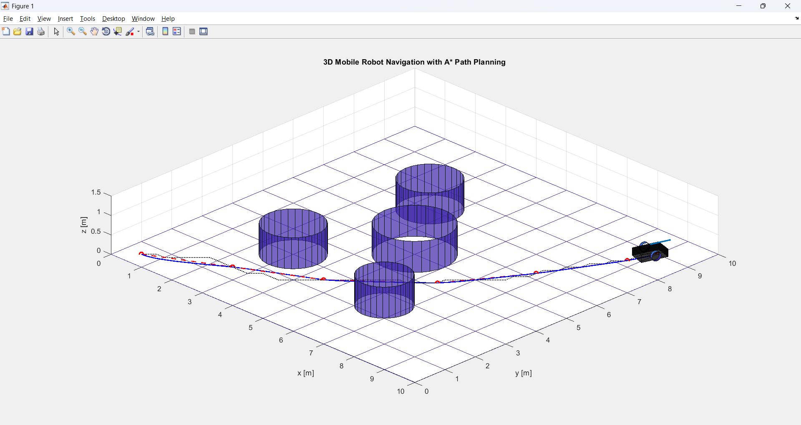
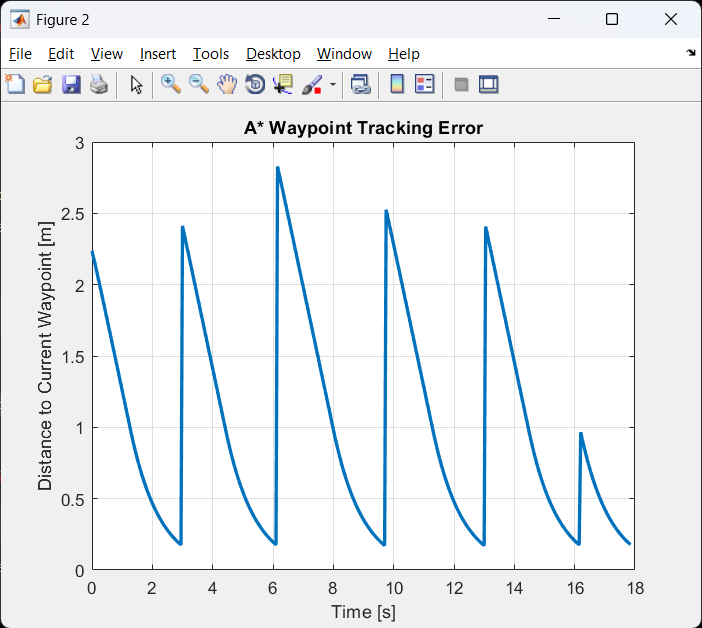

# Autonomous Mobile Robot Navigation using A* Path Planning in MATLAB

## Overview

This project presents a MATLAB-based simulation of an autonomous mobile robot navigating in a 3D environment using the A* path planning algorithm.

The robot generates a collision-free path between a start and goal position while avoiding static obstacles. The generated path is converted into navigation waypoints, which are tracked using a differential-drive robot model.

The project demonstrates key concepts used in autonomous robotics, including path planning, waypoint navigation, robot kinematics, obstacle representation, and trajectory tracking analysis.

---

## Key Features

- A* path planning algorithm
- 3D environment visualization
- Static obstacle avoidance
- Waypoint generation and tracking
- Differential-drive mobile robot model
- Tracking error analysis
- MATLAB implementation without external toolboxes

---

## System Architecture

1. Environment generation
2. Obstacle placement
3. A* path planning
4. Waypoint extraction
5. Robot trajectory tracking
6. Performance evaluation

---

## Project Structure

```text
MobileRobot-AStar/
│
├── astar_navigation_3D.m
├── drawRobot3D.m
├── drawWheel.m
├── README.md
│
└── images/
    ├── navigation.png
    └── tracking_error.png
```

---

## Example Results

### Planned Path and Robot Navigation



### Tracking Error



---

## Applications

This project can be used as a foundation for:

- Autonomous mobile robots
- Warehouse robots
- Indoor navigation systems
- Educational robotics projects
- Path planning research

---

## Future Improvements

- Dynamic obstacle avoidance
- Simultaneous Localization and Mapping (SLAM)
- ROS integration
- Multi-robot coordination
- Real-world sensor integration

---

## Author

Rinesa Hamiti

Department of Electronics, Automation and Robotics

University of Prishtina
